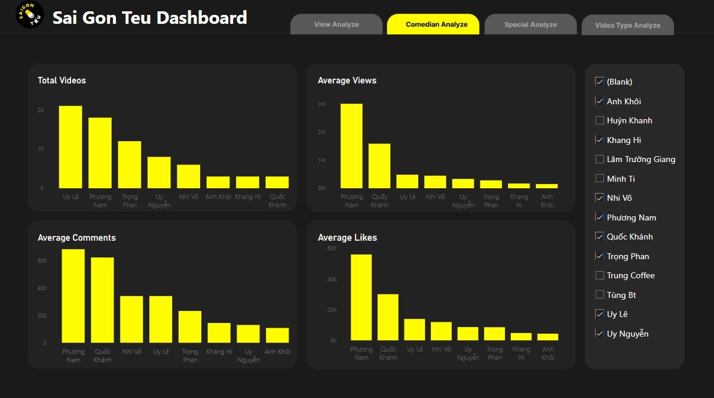

# 📊 Sai Gon Teu Dashboard 


A data analysis and visualization project exploring the performance of Vietnamese stand-up comedians using YouTube video data.

---

## 🎯 Project Highlights

- Collected video data from Sai Gon Teu (a Vietnamese stand-up comedy YouTube channel using the **YouTube Data API**).
- Analyzed and visualized performance trends using **Python** and **Power BI**.
- Assessed each comedian's performance and individual impact in **group videos** based on likes, views, and comments.

> 🗓️ **Note**: The data is from 2023, but the analytical approach remains meaningful.

---

## 🧰 Tech Stack

| Tool/Library              | Purpose                             |
|---------------------------|-------------------------------------|
| `Python`, `Jupyter`       | Data analysis & API queries         |
| `google-api-python-client`| Access YouTube Data API             |
| `Power BI`                | Data visualization                  |
| `pandas`, `numpy`, `isodate` | Data manipulation & time parsing  |

---

## 📁 Project Structure

```bash
SaigonTeu 2025/
├── cleaned data/
│   ├── All_SaiGon_Teu.xlsx
│   ├── dau_teu.xlsx
│   ├── modified_special.xlsx
│   ├── SaiGon_Teu.xlsx
│   ├── SaiGon_Teu_Special.xlsx
│   ├── short.xlsx
│   ├── teu_try_df.xlsx
│   └── ung_tac.xlsx
├── dashboard/
│   └── sai gon teu.pbix           
├── notebooks/
│   └── data_processing.ipynb    
├── .gitignore                   
├── requirements.txt             
└── README.md
```

2. Set up a virtual environment
```
python -m venv venv
source venv/bin/activate  # On Windows: venv\Scripts\activate
pip install -r requirements.txt
```
3. Add your .env file
Create a .env file in the root directory:
```
YOUTUBE_API_KEY=your_api_key_here
```

4. Run the notebook
`Jupyter Notebook`


## 📸 Dashboard Preview    


## 💌 Contact
Feel free to reach out or connect on [LinkedIn](https://www.linkedin.com/in/phambachhiep) if you'd like to collaborate or have any questions!


